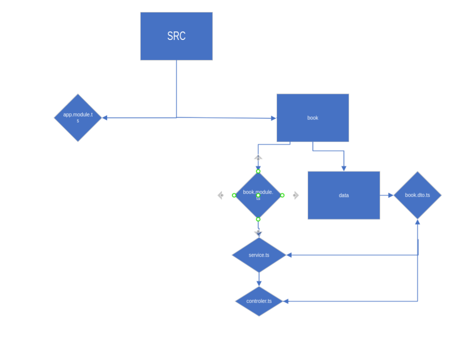

<p align="center">
  <a href="http://nestjs.com/" target="blank"></a>
</p>


## architecture : 



## Installation

```bash
$ npm install   

$ npm install uuid
```

## Running the app

```bash

# watch mode
$ npm run start:dev


```