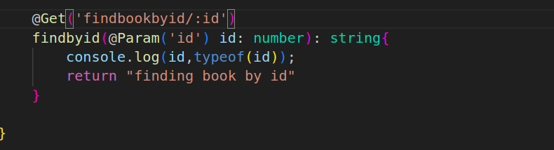
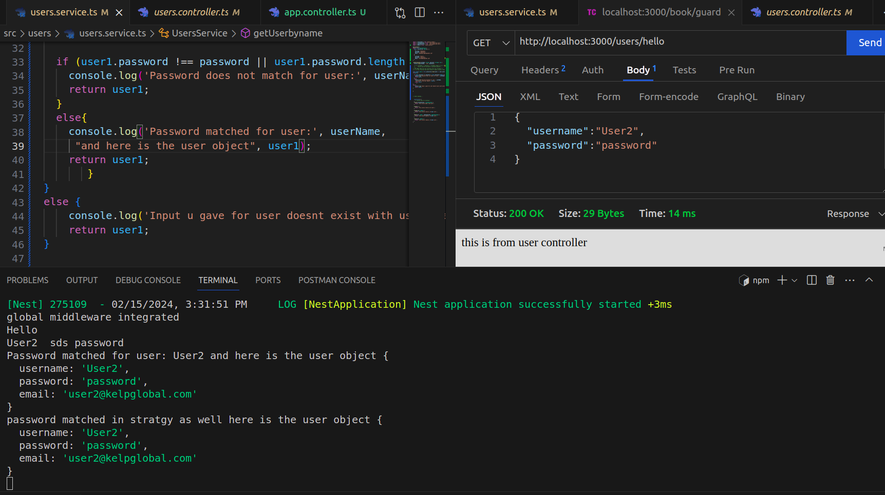
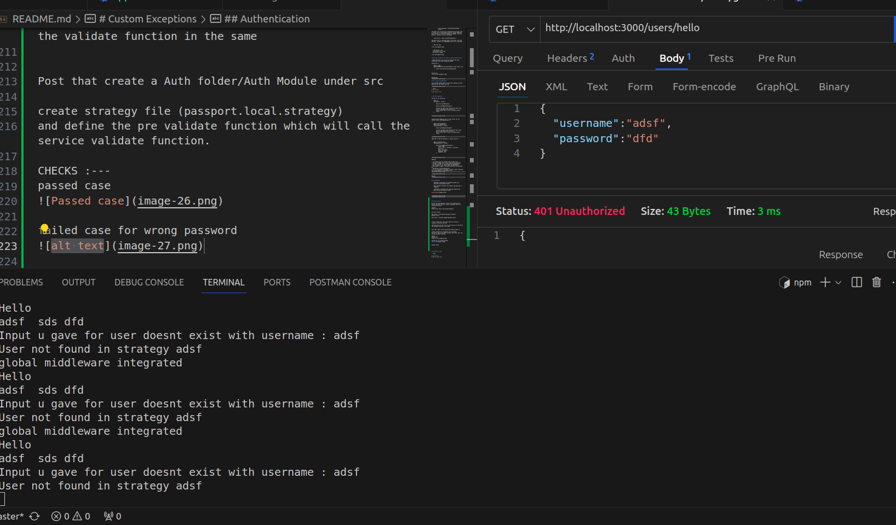

<p align="center">
  <a href="http://nestjs.com/" target="blank"></a>
</p>


## architecture : 


# Middleware Concept:


* Check the code in Main.ts and book.middleware.ts


# Pipes Concept:


* So we here we checking the input type from the controller before passing to service function




After adding ParseIntPipe in the code we now get the desired input


Validation if you pass any thing apart from number in the url than pipe will throw error


Otherwise it wil give you the array
* note u can directly return without console.log in the service.ts function of findbookbyid


# Custom PIPES
* Checkout Pipe.ts and its importing in the controller under add method

# Custom validation via external pipe.ts


*Note check for the DTO file which should have @IsInt Decortr first and than create pipe.ts file 

        ```
            const bookClass = plainToInstance(Book, value);
        ```
the above line is basically transforming the values came as input into a class(object/instance) called bookClass with refernce to structure defined in BookDto  here the @IsInt()  validtrs are not considered

        ```
    const errors = await validate(bookClass);
        ```
the above line is creating array of erros and  here the @IsInt()  validtrs are CONSIDEREd since have to validate

  
  * FOR True case 


  * FOR FAILED  case 
  we passing id as string
  and title as number


# Builtind validation via internal pipe method/function

* BEST Practice to you since nest handles the class transformer and class validation method.

Controller.ts
```
    @Post('/add2')
    addbook2(@Body(new ValidationPipe()) book: Book): any {
        return this.bookservice.addbook(book)
    }

```
Failed Case


Passed Case


## for random id generation

*for testing purpose dont use this when sending id value manually you can remove the code 


```bash
$ npm install   

$ npm install uuid
```


# Custom Exceptions

include in the controller 
```
    @Get("")
    hellobook(): string {

        throw new CustomException

        throw new BadRequestException

        //since the above code executes the below code wont be considered and vice versa
        return "Hello this is the first page without routes"
    }

```


Sending Custom Response just to have log we can use custom Filters check Bookfilter.ts

```
    @Get("/custfiltexcept")
    @UseFilters(BookFilter)
    custfiltexcept(): string {

        throw new BadRequestException

        //since the above code executes the below code wont be considered and vice versa
        return "Hello this is the first page without routes"
    }
```


*BEST WAY to Define Exception is inside controllr 

```
    @Get("/definedincontr")
    definedincontr(): string {

        throw new BadRequestException( {
            status: 400,
            error: "this is defined in controller function",
            host: "localhost",
            anything: "asdf",
            numberany: 123
        })
    }
```


##Guards

* to validate the url content like if theres any 
* string or header that is must required we use guard 
* and than include it in controller using @UseGuard
* you can apply it on single method by mentioning 
* below @Get or apply it to whole controller all methods by 
* mentioning it below @Controller
* to use it globally throughout the app u need to add app.use in App.Module or root module file


Passed: 


## INTERCEPTORS

    Middleware intercepts the incoming request and performs pre-processing tasks.

    Route handler processes the request and generates a response.

    Interceptor intercepts the outgoing response and performs post-processing tasks.


## Authentication 

We will be using Passport library for authentication 
https://www.passportjs.org/packages/
process Passport helps to create Strategies which are utilized by Guards

checkout 
https://docs.nestjs.com/recipes/passport


we first install 
```
npm install --save @nestjs/passport passport passport-local

npm install --save-dev @types/passport-local

```

firstly create User class with name user.entity.ts (similar to DTO but not DTO)

Than add array of user list in usre.service.ts and define the validate function in the same


Post that create a Auth folder/Auth Module under src

create strategy file (passport.local.strategy)
and define the pre validate function which will call the service validate function.

CHECKS :---
passed case


failed case for wrong password


failed case for wrong Username



## AUHTORIZATION
install 
```
npm install --save @nestjs/jwt passport-jwt

npm install --save-dev @types/passport-jwt
```

modify the app.controller endpoint

with 
```
  @Get('hello')
  @UseGuards(AuthGuard('local'))
  gethello(@Request() request) : any{

    const token = this.authservice.generateToken(request.user)
    console.log(token)
    return request.user
  }
```

than create auth.service.ts ( for a Token generation function in the whole payload(i.e request object containing all data))

* check the auth.module.ts to import builtin module(JWT module )

* check the jwt.strategy.ts super() method


now when we send a request with username and password 
it first calls the 

1. 
  @Get('hello')
  @UseGuards(AuthGuard('local'))

than it will pass to passport.local.strategy.ts
2. 
 validate(username: string,password : string): any
    {          
        console.log('Hello ')


        const user : Users = this.userService.getUserbyname(username,password)
        if(!user){
            console.log("User not found in strategy",username)
        }
        if(user == undefined) {
            throw new Un

3. than it will pass to the user.service.ts 

getUserbyname(userName: string, password: string): any {
  console.log(userName, ' sds', password);
  if(user1){

  if (user1.password !== password || user1.password.length === 0) {
    console.log('Password does not match for user:', userName);
    return user1;
  }

Than ONCE YOU RECIEVED correct username and password 

it will again pass loopback and give the control to app controller and will excecute the method define in the method

```
  gethello(@Request() request) : any{
    const token = this.authservice.generateToken(request.user)
    console.log(token)
    return request.user
  }
  ```

4. than inside this it will generate the token by calling
the AuthService Generatetoken function 

```
export class AuthService {
    constructor(private readonly jwtservice : JwtService){

    }
    //idCard
    generateToken(payload: Users): string{
        return this.jwtservice.sign(payload)
    }
}
```

which creates a token and stores it in the token variable


```
 const token = this.authservice.generateToken(request.user)
    console.log(token)
    return request.user
```

so you got the token 


Now use this token and hit androiddev route

* now under thunderclient/postman check for Auth and just add this token under bearer option


## ROLE BASED GUARD
add role: string in the Users.entity.ts
and in auth.constant.ts define ROLEs
and in userservice.ts array add the role elemnt to the object

create route for webdev in controller

now the thing is even the androiddev role can access webdev 

proof:


Androidev: 


androiddev accesing WebDev with same access token


SO to avoid these we will use role.guard.ts 


## Running the app

```bash

# watch mode
$ npm run start:dev


```