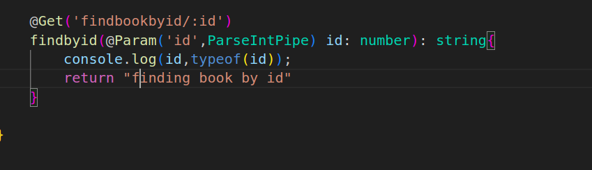

<p align="center">
  <a href="http://nestjs.com/" target="blank"></a>
</p>


## architecture : 


# Middleware Concept:


* Check the code in Main.ts and book.middleware.ts


# Pipes Concept:


* So we here we checking the input type from the controller before passing to service function


After adding ParseIntPipe in the code we now get the desired input



Validation if you pass any thing apart from number in the url than pipe will throw error


Otherwise it wil give you the array
* note u can directly return without console.log in the service.ts function of findbookbyid


# Custom PIPES
* Checkout Pipe.ts and its importing in the controller under add method


*Note check for the DTO file which should have @IsInt Decortr first and than create pipe.ts file 

        ```
            const bookClass = plainToInstance(Book, value);
        ```
the above line is basically transforming the values came as input into a class(object/instance) called bookClass with refernce to structure defined in BookDto  here the @IsInt()  validtrs are not considered

        ```
    const errors = await validate(bookClass);
        ```
the above line is creating array of erros and  here the @IsInt()  validtrs are CONSIDEREd since have to validate

  
  * FOR True case 


  * FOR FAILED  case 
  we passing id as string
  and title as number


## Installation

```bash
$ npm install   

$ npm install uuid
```

## Running the app

```bash

# watch mode
$ npm run start:dev


```